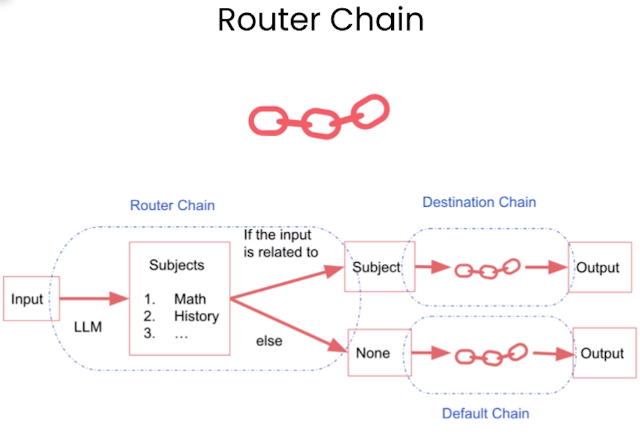
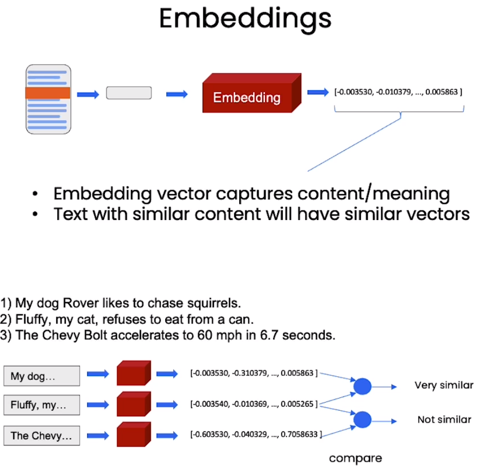
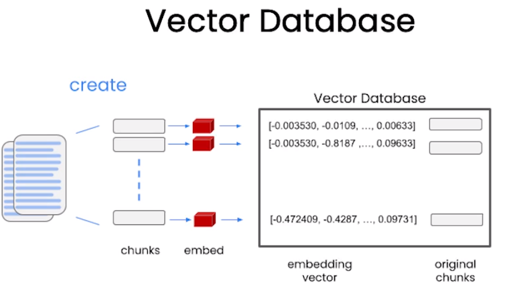
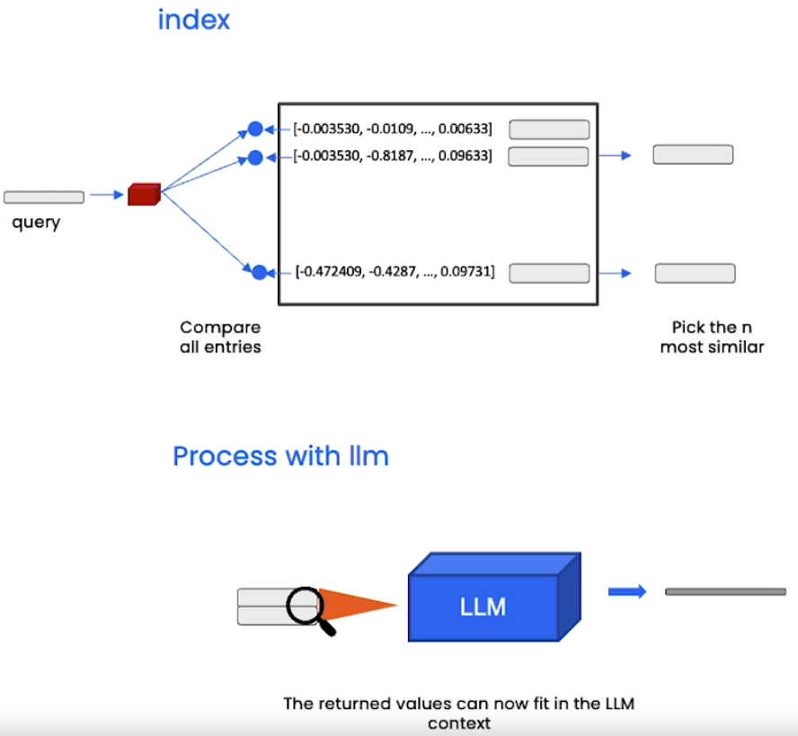

# [LangChain-for-LLM-Application-Development](https://www.deeplearning.ai/short-courses/langchain-for-llm-application-development/)

Welcome to the "LangChain for LLM Application Development" course! This one-hour course, instructed by Harrison Chase, the creator of the LangChain framework, along with Andrew Ng, will equip you with essential skills to enhance the use cases and capabilities of language models in application development.

## Course Summary
In this course, you will dive into various topics that will empower you to leverage the LangChain framework effectively. Here's what you can expect to learn and experience:

1. **Models, Prompts and Parsers**: Discover how to call Language Models (LLMs), provide prompts, and parse the responses.
2. **Memories for LLMs**: Learn how to employ memories to store conversations and manage limited context space effectively.
3. **Chains**: Explore the creation of sequences of operations using LangChain.

 

4. **Question Answering over Documents**: Apply LLMs to your proprietary data and tailor them to meet specific use case requirements.

 

5. **Agents**: Gain insights into the emerging development of LLMs as reasoning agents.

By the end of this course, you will have a solid foundation in using LangChain and will be equipped with a model that can serve as a starting point for developing your own applications using diffusion models.

## Key Points
- Learn LangChain directly from Harrison Chase, the creator of the framework.
- Apply LLMs to your proprietary data and develop personalized assistants and specialized chatbots.
- Expand your utilization of LLMs through agents, chained calls, and memories.

To enroll in the course or for further information, visit [deeplearning.ai](https://www.deeplearning.ai/).
